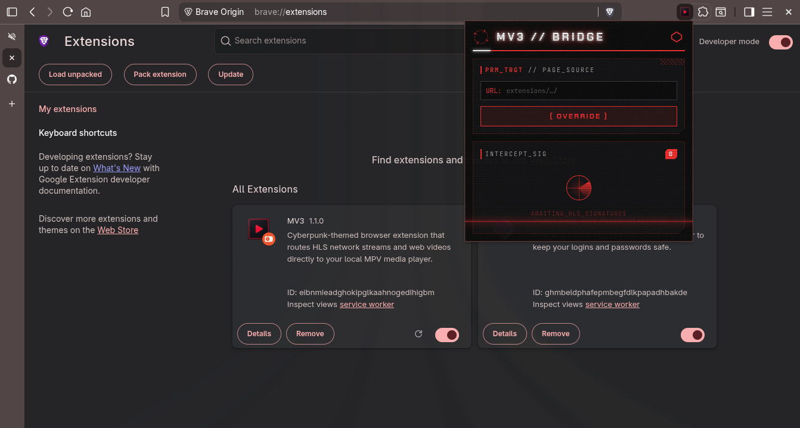
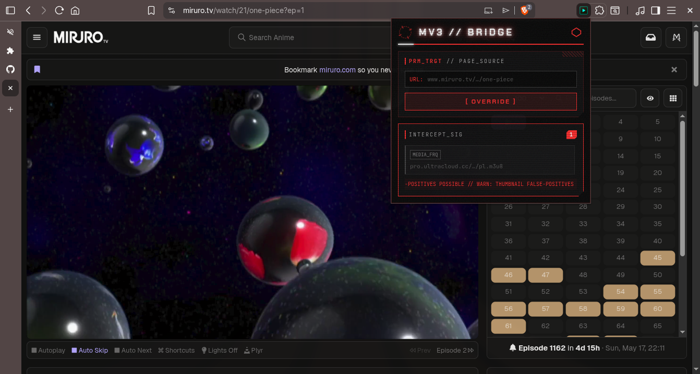
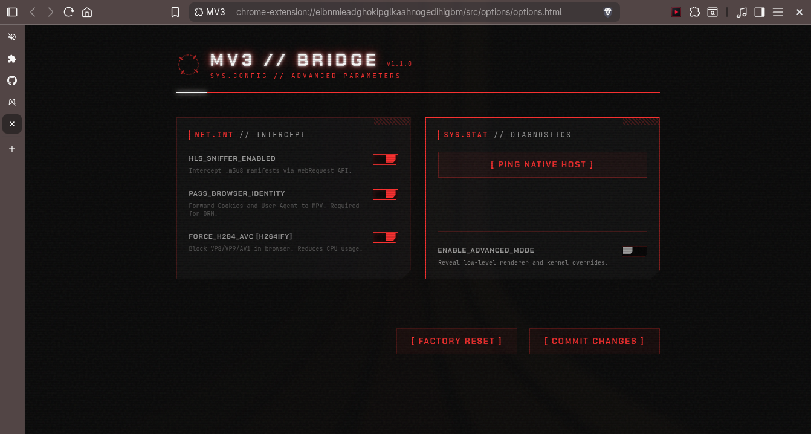
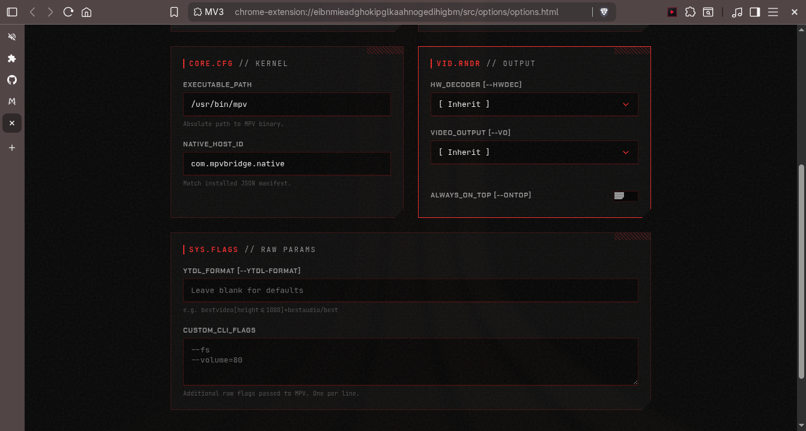

<div align="center">
  

  # MV3 Bridge

  *Route HLS streams and web videos directly to MPV from your browser*

  [](#)
  [](#)
  [](#)
  [](#)

  [Features](#features) · [Prerequisites](#prerequisites) · [Installation](#installation) · [Configuration](#configuration) · [Architecture](#architecture)

</div>

---

MV3 Bridge is a Manifest V3 browser extension that intercepts HLS video streams (`.m3u8`) and web videos, routing them directly to your local [mpv](https://mpv.io/) player via Native Messaging. It provides a seamless playback experience with a cyberpunk-inspired "Terminal Editorial" HUD.

<div align="center">
  
  
  <br>
  
  
</div>

## Features

- **Real-Time HLS Interception**
  - Sniffs `.m3u8` manifests using the `webRequest` API
  - Automatically classifies streams as master or media playlists
  - Displays detected streams in the popup HUD

- **Contextual Dispatch**
  - Right-click any page, link, video, or audio element to dispatch to MPV
  - Use the OVERRIDE button to send the current page URL directly

- **Codec Enforcement (h264ify)**
  - Blocks VP8, VP9, and AV1 codecs in the browser
  - Forces sites like YouTube to serve H.264
  - Reduces CPU usage on older hardware

- **Terminal Editorial UI**
  - Cyberpunk-inspired brutalist configuration HUD
  - Built-in documentation panel with copy-paste CLI snippets
  - Glitch text effects and system-inspired aesthetics

## Prerequisites

| Requirement | Purpose |
|-------------|---------|
| Linux | Native messaging host uses Linux-specific paths |
| Python 3 | Powers the native messaging intermediary |
| [mpv](https://mpv.io/) | Target media player |
| [yt-dlp](https://github.com/yt-dlp/yt-dlp) | Video extraction backend |

## Installation

The system consists of two components: the browser extension and a native messaging host.

### 1. Load the Extension

1. Open `chrome://extensions` (Chromium) or `about:debugging` (Firefox)
2. Enable **Developer mode**
3. Click **Load unpacked** and select the repository root

> [!TIP]
> Copy the Extension ID from the extension card—you'll need it for the next step.

### 2. Register the Native Host

```bash
cd native_host
chmod +x installer.py
./installer.py
```

Follow the interactive prompts to select your browser and paste the Extension ID.

### 3. Verify Connection

Open the extension popup, navigate to **Options**, and click **[ PING NATIVE HOST ]**. A successful connection shows `✓ CONNECTED`.

> [!NOTE]
> To uninstall later:
> ```bash
> ./installer.py --uninstall
> ```

## Configuration

All configuration is handled through the Options Terminal.

### Basic Options

- **HLS Sniffer** — Enable/disable automatic stream detection
- **Pass Identity** [EXPERIMENTAL] — Forward cookies and User-Agent to MPV

### Advanced Mode

Enabling **Advanced Mode** unlocks additional parameters:

| Parameter | MPV Flag | Behavior When Unset |
|-----------|----------|---------------------|
| HW Decoder | `--hwdec` | Defers to `mpv.conf` |
| Video Output | `--vo` | Defers to `mpv.conf` |
| Always On Top | `--ontop` | Defers to `mpv.conf` |
| YTDL Format | `--ytdl-format` | Defers to `mpv.conf` |
| Custom CLI Flags | Raw injected | None |

> [!IMPORTANT]
> The extension is non-destructive. Blank parameters defer to your local `~/.config/mpv/mpv.conf`.

### System Directives

Click **[ VIEW DOCS ]** in the configuration panel to access the built-in documentation with CLI flag examples like `--autofit=50%`, `--save-position-on-quit`, and `--ytdl-raw-options`.

## Architecture

```
mv3/
├── manifest.json                 # Extension manifest
├── src/
│   ├── background/
│   │   ├── background.js         # Service worker entry point
│   │   ├── config.js            # Configuration state
│   │   ├── badge.js             # Icon state controller
│   │   ├── tab-state.js         # HLS state cache
│   │   ├── hls-sniffer.js       # .m3u8 detection
│   │   ├── native-messaging.js  # OS dispatch
│   │   └── message-router.js     # Internal message bus
│   ├── popup/                    # Stream interceptor HUD
│   ├── options/                  # Configuration terminal
│   ├── docs/                     # Documentation panel
│   └── utils/                    # Shared utilities
├── native_host/
│   ├── installer.py              # Interactive installer
│   └── mpv_bridge.py            # Native messaging host
└── icons/                        # State icons
```

### Data Flow

```
[Browser Tab] → webRequest → HLS Sniffer → Local Storage
                                           ↓
[Popup HUD] ← Message Router ← Service Worker
      ↓
"Send to MPV" → Native Messaging → mpv_bridge.py → mpv
                 (stdio JSON)    (cookie sync)   (detached)
```

## Limitations

- **Browser Support**: Tested on Brave Origin Nightly and Chromium only
- **Cookie Passing**: Highly experimental. Does not work reliably with Chromium-based browsers due to app-bound encryption and YouTube PO token requirements. Expect failures for authenticated content.
- **Platform**: Linux-only. macOS/Windows would require installer modifications